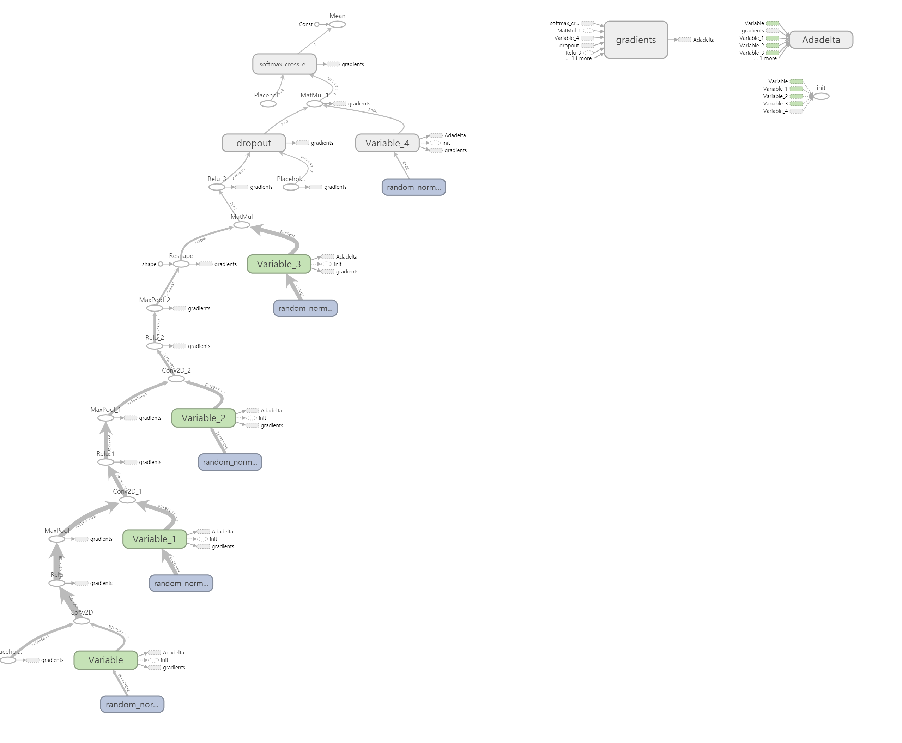

# animal_classification
## tensorflow tutorial cnn 코드 업데이트
본 프로젝트는 tensorflow를 wrapping한 tflearn으로 짜여져있습니다

 
## libs for project 
1. python ver=3.6
2. tflearn==0.3.2
3. tensorboard==1.10.0
4. tensorflow==1.10.0
5. tensorflow-tensorboard==0.4.0rc2
6. numpy==1.13.3
7. opencv-python==3.4.3.18

## 패키지 버전에 맞춰 설치 하는 법
1. console(Terminal, Python console X)
2. pip install -r requirements.txt

## 패키지 변경이 있을 경우 
1. pip freeze > requirements.txt
2. 커밋 후 push
3. 버전은 항상 맞춰 

## Dataset 

https://www.kaggle.com/rahul897/catsdogs
링크의 자료를 

## 프로젝트 구조

그래프의 세부구조가 보고 싶으면 codes/boardGraph 경로에 위치한 파일을 terminal에서   
tensorboard --logidr = ./codes/boardGraph
를 하면 됩니다

## 프로젝트 폴더 구조
┌─classification  
│  ├─AnimalClassification(클래스화 된 그래프 우치)  
│  │  └─__pycache__  
│  ├─boardGraph(현재 사용 안 함)  
│  ├─checkpoint(현재 사용 안 함)  
│  ├─checkPoint_2conv(현재 그래프 사용하는 메타 데이터 존재)  
│  ├─data(학습 데이터 위치)  
│  ├─log(그래프 파일 위치)  
│  │  ├─dogsVScats-0.0001-2conv-basic.model  
│  │  ├─dogsVScats-0.0001-64-2conv-basic.model  
│  │  ├─dogsVScats-0.001-2conv-basic.model  
│  │  ├─dogsVScats-1e-05-2conv-basic.model  
│  │  ├─dogsVScats-1e-06-2conv-basic.model  
│  │  └─dogsVScats-1e-07-2conv-basic.model  
│  └─__pycache__  
├─my-model(현재 사용 안 함)  
├─old_only_tf(tf로 짠 전 코드)  
├─resources(readme 파일에 삽입하는 이미지 위치)  
│  └─img  
└─test_file(테스트 파일 위치)  
